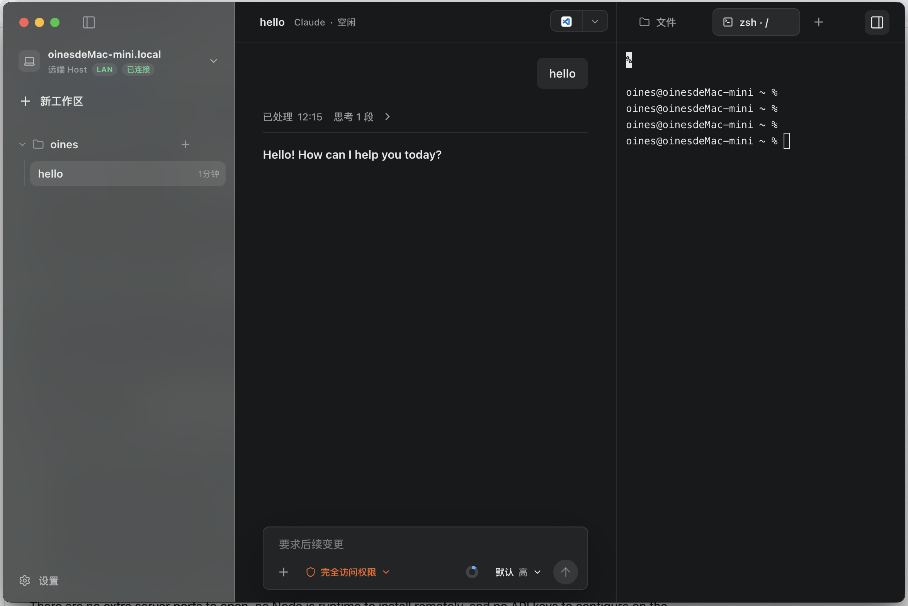

# AstralOps

[English](./README.md) · [Telegram 群](https://t.me/Project_AstralOps)

**把你的 AI 编程助手带到任何远程服务器。**



---

## 这是什么？

Claude Code 和 Codex 很强大，但它们有一个根本限制：**只能操作本地文件系统**。如果你的代码在远程服务器上——一台 VPS、一台内网开发机、一台树莓派——你要么把整个代码库拉到本地（不现实或不允许），要么在远程机器上重新安装一套完整的 AI 工具链（费时费力，有些机器根本跑不动）。

AstralOps 解决这个问题。

它是一个桌面客户端，给 Claude Code 和 Codex 包了一层可视化的工作台界面。但真正让它不一样的是：**你可以通过 SSH 连接到任意远程服务器，AI 助手在你性能强大的本地电脑上运行，而所有的代码操作——执行命令、搜索代码、编辑文件——直接发生在远程服务器上。远程机器不需要安装任何东西。**

## 它具体怎么工作的？

假设你要在一台远程 Linux 服务器上用 Claude Code 排查 Bug：

1. 你在 AstralOps 桌面端点击"新建工作区" → 选择 SSH → 输入服务器地址和目标目录
2. AstralOps 自动通过 SSH 将一个极小的 `proxy-agent`（无依赖的 Go 二进制）上传到远程服务器并启动
3. 你在本地的对话框里输入 prompt，Claude Code 在本地运行
4. 当 Claude 需要执行 `grep`、`cat`、`npm test` 或编辑文件时，AstralOps 将这些操作通过 SSH 标准 I/O 流发送给远端的 `proxy-agent` 执行

**整个过程不需要在服务器上开放额外端口，不需要安装 Node.js，不需要配置 API 密钥。** SSH 能通就能用。

## 多设备远程控制

AstralOps 还内置了一套端到端加密的远程控制协议。你可以把另一台电脑配对到你的桌面 Host，远程查看和控制它上面正在运行的 AI 会话。

这意味着什么？

- 你在公司电脑上启动了一个长时间运行的 Claude Code 任务，回到家打开笔记本就能继续监控、发 prompt
- 团队成员可以配对到你的机器，查看你的 AI 会话进展（当然，需要你的授权）

架构上，每台桌面客户端同时扮演两个角色：

- **Host**：运行 daemon、管理 AI 会话、执行所有操作、保存所有数据
- **Controller**：连接到另一台 Host，远程使用它的完整能力

Controller 和 Host 之间通过 ECDH 密钥协商建立 AES-GCM 加密通道。Cloud 服务和 Relay 中继节点只负责设备发现和流量转发，**无法解密任何内容**——不能看到你的 prompt、代码或终端输出。

同一局域网内的设备通过 UDP 广播自动发现，跨网络则经由 Relay 中继。

> **计划中**：未来会推出手机端 App（纯 Controller），让你可以从手机上远程监控 AI 会话、发送 prompt。手机端不运行 AI，不保存数据，所有操作都由桌面 Host 执行。

## 功能列表

### SSH 远程 AI 工作区

- **零侵入部署**：自动通过 SSH 推送 `proxy-agent` 到远端（Linux/macOS，x86/ARM）
- **双引擎支持**：Claude 工作区使用 MCP 远程工具转发，Codex 工作区使用 exec-server 转发
- **JSON-RPC over SSH**：无需开放额外端口，复用 SSH 标准 I/O

### 多设备远程控制 Mesh

- **端到端加密**：ECDH + AES-GCM，Cloud/Relay 无法解密
- **设备配对**：基于 Ed25519 设备密钥，支持信任授予和撤销
- **自动发现**：LAN 内 UDP 广播发现，跨网络 Relay 中继
- **细粒度权限**：15+ 种能力标签（读取、控制、编辑、执行、终端等），按设备独立授权
- **完整远程操作**：管理工作区和会话、发送 prompt、浏览修改文件、执行命令、打开终端

### 桌面工作台

- **实时对话流**：Markdown 渲染、代码高亮、工具调用展开折叠
- **富媒体附件**：图片和文件的上传、预览、流式传输（分块上传最大 512 MB）
- **内置终端**：基于 xterm.js 的 PTY 终端，多标签、attach/detach、resize
- **会话管理**：创建、分叉（fork）、删除，上下文迁移，事件时间线
- **工作区管理**：本地一键创建，SSH 工作区读取 `~/.ssh/config`
- **自动更新**：集成 electron-updater

## 架构

```text
┌─────────────────────────────────────────────────────────────┐
│  Desktop App (Electron + React + Tailwind)                  │
│  对话界面 / 内置终端 / 文件预览                             │
│                     ↕ WebSocket / HTTP                      │
├─────────────────────────────────────────────────────────────┤
│  Daemon (Go)                                                │
│  ┌──────────────┐ ┌──────────────┐ ┌─────────────────────┐ │
│  │ Claude       │ │ Codex        │ │ SSH Proxy           │ │
│  │ Runtime      │ │ Runtime      │ │ + proxy-agent 部署  │ │
│  ├──────────────┤ ├──────────────┤ ├─────────────────────┤ │
│  │ Session      │ │ Event Hub    │ │ Control Gateway     │ │
│  │ Store (JSONL)│ │ + Projection │ │ + E2E Encryption    │ │
│  └──────────────┘ └──────────────┘ └─────────────────────┘ │
├─────────────────────────────────────────────────────────────┤
│  proxy-agent (Go)             │  Relay Server (Go, 可选)    │
│  零依赖，部署在远端           │  不透明流量中继              │
│  通过 SSH I/O 执行操作        │  无法解密任何内容            │
└───────────────────────────────┴─────────────────────────────┘
```

## 目录结构

```text
apps/desktop/     桌面界面 (Electron + React + Tailwind + Framer Motion)
daemon/           本地核心 (Go)：AI 运行时、会话管理、SSH 隧道、远程控制 Mesh
proxy-agent/      远端代理 (Go)：零依赖单体，通过 SSH 执行文件操作和命令
relay/            中继服务器 (Go)：为跨网络设备提供加密流量中继
protocol/         通讯协议 (TypeScript)：JSON-RPC 类型定义
internal/         共享内部库：relayauth / relaybroker
scripts/          构建和打包脚本
```

## 快速上手

```bash
# 确保本地已安装 Node.js 和 Go
npm install
npm run dev
```

启动桌面端后，点击"新建工作区"，选择本地目录或 SSH 远程连接（支持读取 `~/.ssh/config`）即可开始。

## 打包桌面客户端

```bash
npm install
npm run package:desktop
```

打包脚本自动识别当前系统和 CPU 架构：

| 平台    | 产物                            |
|---------|--------------------------------|
| macOS   | `.dmg` + `.zip`                |
| Linux   | `AppImage` + `.deb`            |
| Windows | Portable + NSIS 安装包          |

产物输出到 `release/desktop/out/<platform>-<arch>/`。打包时自动构建并内置本机 daemon 和远端 `proxy-agent`。建议在目标系统上打对应平台的包。

## CI 发布流程

`dev` 为日常开发分支，`main` 为发布分支，只通过 `dev → main` PR 合并。

合并到 `main` 后，GitHub Actions 自动判断是否需要发版：

- 仅文档变更则跳过
- 包含产品代码变更则自动递增版本号（遵循 Conventional Commits）、构建三平台客户端并创建 GitHub Release
- 产物附带 `SHA256SUMS.txt`

## 安全与隐私

- 所有 API Keys、AI 思考过程和聊天记录均保存在本地 `~/.AstralOps`
- SSH 连接复用本地系统 `ssh` 进程，AstralOps 不触碰、读取或保存 SSH 私钥
- 设备间控制通道端到端加密（ECDH + AES-GCM），Cloud/Relay 无法查看任何会话内容
- 无任何形式的云端遥测和数据收集

## 许可证

[AGPL-3.0](./LICENSE)
